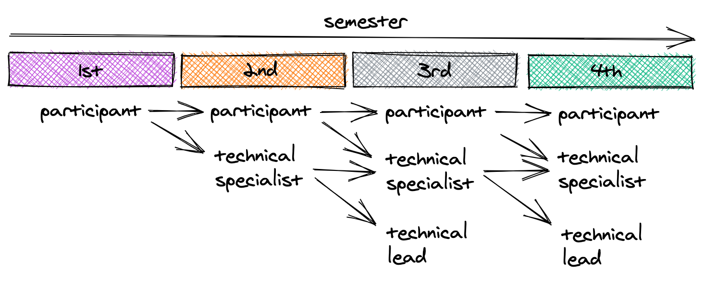

title: Constitution

# Race On Constitution

## Preamble
*The goal of the Race On organization is to provide the opportunity for students to acquire real-world experience on the materials learned in class in the context of self-driving cars.*

## Article 1 – Membership

1. All participants of Race On are considered members of the organization. 
2. After one semester of participation, a participant can either choose to continue to participate in the Race On competition or be an office bearing member (also office bearer) and take part in shaping the future of the organization.
3. Participants, non office bearers, work as part of a team to record their fastest possible lap on the track and are eligible to win prizes.
4. Office bearers can also participate in the Race On competition for time and rank but they are barred from competing for prizes. 
5. Participants do not get any voting or nomination rights in organization elections ;like office bearers do.
A person can hold the title of participant as long as that person is not an office bearer.

## Article 2 – Office bearers and the organizing board
1. For the first semester, members can only be participants of the Race On competition. 
2. After one semester of participation, members can opt to become office bearers. 
3. After the first semester of membership as a participant, members are allowed to apply to hold the office of technical specialist to work on one or more of the project areas proposed for the semester. 
4. At the beginning of the semester, technical leads and other office bearers select viable candidates from the pool of applicants for holding the office of technical specialist. This office is designed to be equivalent to an engineering internship. Therefore, the earliest a person may be a technical specialist is in their second semester of membership, following one semester of participation in the Race On competition.
5. After at least one semester of holding the office of technical specialist, members may nominate themselves to be voted into an office within the cabinet. This means members can hold cabinet positions only from their third semester as organization members.
6. The number of terms in office for a Technical Specialist is unrestricted.
7. A Technical Specialist works on one or more projects defined by the technical leads and other office bearers. Role functions like an engineering internship with concrete deliverables.
8. The cabinet comprises the president, vice president and technical leads. 
9. Members are voted into these offices from a pool of nominees every semester. 
10. Additionally, the faculty advisor is considered an executive member of the organization with a permanent seat in the cabinet. 
11. All cabinet members get one vote towards the election of technical leads.
12. The President is elected for a term of one semester from a pool of people that held the title of technical specialist or above for at least one semester.
13. The President role is to lead the organization and help its members to achieve the proposed goals. Responsible for the operation of the organization, liaising with USC and departmental administration, and recruiting new members in addition to providing technical assistance where needed. 
14. The president is elected among nominated office bearers through general vote by all office bearing members. 
15. The president may also cast one extra recorded (non-anonymous, publicly disclosed) vote in any election resulting in a tie. 
16. Former presidents have the option to cast one vote towards the selection of projects and technical leads. There may only be one president for the organization at any time.
17. The runner-up in the presidential election is nominated as Vice President.
18. The vice president shares duties and responsibilities with the president including assisting in the leadership of the organization, and recruiting new members. 
19. Former vice presidents have the option to cast one vote towards the selection of projects and technical leads. There may only be one vice president for the organization at any time.
20. Technical Leads are elected for one semester term from a pool of people that held the title of technical specialist or above for at least one semester.
21. Technical Leads guids a team of Technical Specialists on a project to add features to or improve the track performance of the car. At the end of every semester, each team will publish an article/blog post as a tutorial and hold workshop sessions as needed with the participants. 
22. There may be more than one technical leader for a project. At the same time, a technical leader can lead more than one project. 
23. Technical leaders for a project are elected by a majority vote of the president, vice president and past cabinet members after nominations among office bearers. 
24. Office bearers may nominate themselves as candidates by proposing project ideas that they want to implement. Candidates will present their projected ideas for the projects they want to lead, which will form the basis for their election to office.
25. A staff or faculty member of USC holds the position of faculty advisor. 
26. The faculty advisor oversees the operation of the organization and ensures that the Race On continues to comply with USC policies. 
27. There may be one or more faculty advisors for the organization.

## Article 3 – Elections

1. Elections must happen for all cabinet offices in the week before the final race. 
2. The elections must be ratified by the faculty advisor(s) of the organization and the retiring cabinet members.

### Section 3a: Eligibility and Nominations

1. Technical specialist candidates must have completed at least one semester as participants before applying for candidacy. (Online form application)
2. All candidates for office bearer posts need to have completed at least one semester as a technical specialist to be eligible for nomination.
3. Technical leads may be nominated on the basis of one or more new project ideas, improvements to old projects, or novel tracks in existing projects.
4. Former and current presidents and vice presidents may nominate themselves as candidates for the same positions only if the entire current cabinet not including themselves unanimously approves of the nomination.
5. Former president and vice president must ensure a smooth power transition and knowledge transfer to the new president and vice president.

### Section 3b: Voting
1. During a voting cycle, the existing cabinet selects technical specialists from the list of candidates and assigns them to projects based on their preferences. 
2. Then, all current office bearers including technical specialists and the cabinet vote for the new president and vice president among the nominated candidates.
3. Now, the newly formed cabinet votes on the new technical leads to be inducted into the cabinet as well as the project ideas that will be pursued for the upcoming semester. Here, former presidents and vice presidents of the organization each get one vote.

### Article 4: Emergency powers

1. The faculty advisor(s) have full autonomous authority to override all or any part of the constitution including fill all offices including cabinet positions without the need for any approval so long as the goals of the organization as defined in the preamble are not breached.
2. With approval from the faculty advisor(s), the current president and vice president may also fill the entire cabinet without elections in case vacancies of office need to be addressed. 

## Article 5: Projects

1. Current cabinet members and new technical lead candidates can suggest new projects, additional technical tracks based on the proposed projects, or improvements to old projects. 
2. The list of projects must be made available on the Race On webpage and updated by the members of the organization. 
3. At least one project in each of the following tracks must be fulfilled each semester: Perception, Control, Planning, Simulation
4. It is also crucial that at the end of the semester, the technical lead(s) spearheading the project write a report, technical paper, or blog post detailing their progress. Additionally,  workshops and tutorials must be conducted as needed to disseminate the information among all members and participants of Race On. 

## Article 6: Constitutional committees
First Constitutional committee (September 4, 2020) comprises Suraj Chakravarthi Raja with Valeriu Balaban, Fernando Valladares Monteiro, Jayson Sia, Amy Puente, Ali Marjaninejad and Thanos Rompokos.

