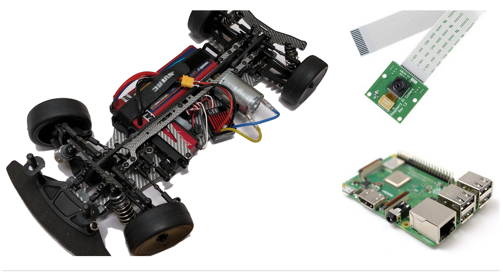

title: Home

# Race On – USC Self-Driving Car Competition


## Announcements

!!! attention "Spring 2020 Race On Information Session"
    Date: **Jan. 16, 2020 (5:00 - 6:50 PM)**

    Venue: **THH 101**

    The Spring 2020 Race On Information Session is open to all undergraduate and masters students who are interested in registering for this semester's race competition. Previous race participants are all encouraged to attend so as to get informed about the new race rules and design changes.

!!! note "Registration Open!"
    Registration is now open for the Spring 2020 Race On self-driving car competition.

    Registration is open until midnight on **Sunday, January 19, 2020**. The first 30 teams composed of only new members will be admitted while the rest placed on a waiting list. No such restriction is applied to returning teams. Register [**here**](registration).

---

<iframe width="1120" height="440" src="https://www.youtube.com/embed/gfciEIwzgJo" frameborder="0" allow="accelerometer; autoplay; encrypted-media; gyroscope; picture-in-picture" allowfullscreen></iframe>

## Challenge Overview

The goal of this competition is to engage students in hardware-software development of a self-driving car for racing. Teams of 2 to 4 students compete to build the fastest car and have one semester to prepare for the two races, when all cars, turn by turn, race to record the fastest time. The competition is for USC Viterbi masters students and undergraduate juniors and seniors, regardless of Viterbi program or year. Sophomore undergraduate students are also welcome; however, the difficulty of this competition may be more appropriate for more experienced students. Students are not expected to have prior experience with self-driving cars. Teams will receive instructions how to assemble a car from scratch and program the control algorithm of a self-driving car. All cars are built on the same platform and race against each other on the same track configurations, thus innovation and creativity is what counts.

To help the teams get started, a series of workshops on embedded hardware and software concepts will be organized to provide technical support to the students especially during the initial phase of the race. In addition, optional weekly sessions are to be held where teams can work on their projects and interact with other teams. Though these workshops are meant to help the teams develop their car, outside work on the project will be necessary, since an exceptional car will require thoughtful optimization to excel. With these workshops as a starting place, teams are given the unique opportunity to apply their technical knowledge and creative abilities to a real-world situation.


## Fees and Prizes

For new teams, the fee to participate in Race On is **$250 per team**. This fee covers all the materials needed to assemble a self-driving car, such as the car kit, raspberry pi plus other components and accessories. Teams **can get $100 back** along with additional sensors and components by actively participating in races. Winning teams even stand a chance to **win up to $400**. See [**Rules**](rules) section for details.

## Car Kit

Upon registration, new teams will receive their car, described below. Teams with returning members will use their previous car.

The car is built around a 1/10 scale RC touring chassis powered by a brushed motor and a 2–cell LiPo battery. The Raspberry Pi microprocessor through image processing will detect the track from the images supplied by a camera and adjust the steering angle and the motor speed to keep the car on the track. The images below show the assembled car, the camera and the Raspberry Pi board that when assemble form the car to be raced. The chassis, battery and the motor are regulated to ensure that no team gains an advantage through better components, and that creativity and superior programming differentiate the teams.



Modifications of the chassis are allowed as long as the changes are follow the competition rules. Moreover, more sensors can be added as long as the camera remains the main sensor used for steering the car. Cars are permitted to have a wireless connection with a computer for development and calibration, however, during the final race the car should operate autonomously and no external connection is permitted. All cars will be inspected before the final race and only the ones which comply with the above rules will be allowed to compete.


<!-- **To receive the car, each team (not each individual member) will pay $80 to offset the cost of the car and another $80 as a refundable deposit, which will be returned to the team after completing both races. The car originally costs approximately $200-$260, and the Raspberry Pi and the camera are included in this cost.** -->


<!-- For full documentation visit [mkdocs.org](https://mkdocs.org).
## Test Code

```python hl_lines="3"
import numpy as np

a = np.array([1, 2, 3])

print(a.T @ a)
```

## Commands

* `mkdocs new [dir-name]` - Create a new project.
* `mkdocs serve` - Start the live-reloading docs server.
* `mkdocs build` - Build the documentation site.
* `mkdocs help` - Print this help message.

## Project layout

    mkdocs.yml    # The configuration file.
    docs/
        index.md  # The documentation homepage.
        ...       # Other markdown pages, images and other files. -->
