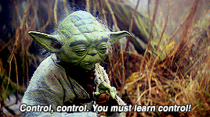
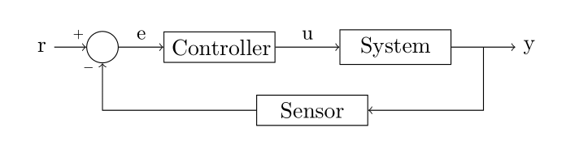
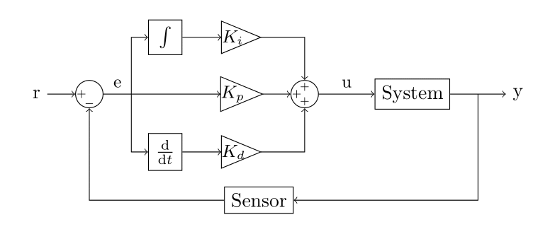

title: 2. Gain Scheduling

# Gain Scheduling

You assembled your car, connected it to your computer, tested the electronics, and hopefully got to run a few laps. So, what's next? Yoda has the answer for you!


<!--  -->

We have already encouraged you to improve the original self-driving code by adding integral and derivative terms to the PID controller. We will now introduce a new control technique called *Gain Scheduling*, which can be seen as an extension of PID.

## Theory
!!! note 
    The following is a *very* simplified view of the topics. This is just to provide you an intuition of how the controllers work.


### Feedback Control
Let's start with a quick recap on feedback control. One of the simplest ways to represent a typical control problem is through a block diagram.



Our goal is to make the system output *y* as close as possible to the reference *r*. In order to do that, we use a sensor to measure variable *y*, compute the difference between current and desired value to obtain the error *e* and feed it to a controller. And here is where the magic happens. The controller block is responsible for transforming the measured error *e* into a command *u* which brings the system's output *y* closer to the reference *r*.

**Exercise**:
Try to identify each of the elements in the block diagram in the context of Race On. What is the system and what is the sensor? Which variables in your code are *r*, *e*, *y* and *u*?

Controllers can take very different forms. One example is the *on-off* mechanism of the heaters with a thermostat: the heater turns on when the temperature is below the reference and it turns off when the temperature is above the reference. Another example is the *proportional* controller, which can be described by *u = Ke*. We can also have a controller which computes system inputs based not only on the current error, but also based on the error integral and derivative. This leads to the famous [PID controller](https://en.wikipedia.org/wiki/PID_controller "Wikipedia: PID").



Note, the above diagram is for continuous time systems, our car is a discrete time system since we send one control command per image and not continuously while waiting for the next image. In discrete time systems the integral is replaced with the sum operator and the derivative with the difference between current and past error. The controller gains ```Kp```, ```Ki```, and ```Kd``` have to be selected such that the system presents the desired behavior (fast convergence to *r*, low overshooting etc). If we have a mathematical model of the system, there are analytical and graphical tools that help tuning the gains. In other cases, the gains are set using trial and error.

**Exercises**:

1. If you haven't yet, try to implement a PID controller for your car. You can reference this .
2. Search online for hints on how to tune the different gains. What are the expected effects of increasing/decreasing each one of them?

### Gain Scheduling
A well tuned PID controller can yield very good performance. However, what happens if the operating condition changes? Airplanes are a good example. The system behaves remarkably different at take-off, in-flight and on landing. In these cases, the gains tuned for one operating condition might not lead to the desired behavior when the system is at another operating point. One possible solution to this problem is gain scheduling. It is usually done in 4 steps:

1. Define the different system operating conditions;
2. Tune your controller gains for each operating condition. This will create an array (or a table) of controller gains;
3. Determine how to vary the controller gains based on the operating conditions;
4. Assess system performance.

Steps 1, 2, and 4 are the same as you would do for a regular PID controller. Step 3 is the fun part! The main options are:

* *Simple switch*: change the gains when the system is at a different operating point. The advantage of this method is its simplicity. However, this creates discontinuities. If the error is 2 and the gain changes from 2 to 5, your control input jumps from 4 to 10! This can damage actuators or create undesirable system behavior.
* *Transient switch*: when the operation conditions change, linearly change from one gain to the other within a certain time interval. The trick here is to choose the time interval long enough to create a smooth transient but short enough to allow the controller to respond properly to the operating condition change.
* *Interpolate between gains*: we can avoid switching by creating a curve that smoothly changes between gains continuously. This is possible when the operating conditions also change continuously.

The three cases are illustrated below, where ```tc``` is the time when the operating condition change is identified, and ```T``` is the transient time for the transient switch approach.


<!--  -->

For a more in depth introduction to gain scheduling, we recommend watching this [video](https://www.youtube.com/watch?v=YiUjAV1bhKs).

## Applied to Race On

For now, let's assume your car is set to a constant speed and we only want to control the position relative to the center of the track. We will reference the original code provided with the car but it should be easy to adapt these instructions to your modified code. If you have any issues with it, remember you can always check the original code at the [race on](https://github.com/race-on) github. We follow the 4 steps described previously:

1. Define the different system operating conditions.

    Even though the car itself doesn't change much during the race, the track varies considerably. We can define three different operating modes for the car: straight line, 90<sup>o</sup> turn and 180<sup>o</sup> turn.  Next, we have to find a way to identify these conditions. One way of doing this is by looking at the error. This requires a few steps and some tuning. Let's get to it!

    Create an error array in your code before the loop starts and populate the array at every iteration:
    ```python
    error_array = []
    for f in stream:
           [...]
           error = CAMERA_CENTER - line_pos
           error_array.append(error)
    ```
    Then, run a lap on the track and plot your error with the command `plt.plot(error_array)`.   You should be able to map different peaks and valleys on your error plot to straight lines, 90<sup>o</sup> and 180<sup>o</sup> turns on the track. After this, you can create thresholds to identify when the car is in each of these scenarios.

2. Tune your controller gains for each operating condition.

    While it's complicated to tune the controller individually for each operating condition, we can use our knowledge of the problem to estimate how the gains should change. Intuitively, an error on a straight line doesn't need to be corrected as aggressively as errors on turns. Therefore, let's define:
    ```python
    K_0 = 5000
    K_90 = 7000
    K_180 = 9000
    ```

3. Determine how to vary the controller gains based on the operating conditions

    We will use a simple discrete switch. Based on your observation of the errors, create thresholds and use them to choose your gain:
    ```python
    e_90 = 50
    e_180 = 75
    [...]
    for f in stream:
        [...]
        gain = K_0
        if error > e_180:
          gain = K_180
        elif error > e_90:
          gain = K_90

        DUTY_CYCLE = SERVO_MIDDLE + gain*error
    ```

4. Assess system performance.

    Use the error plot to check your car performance on the track. Is it overshooting after turns? Does it take too long to realize it's in a turn? Or maybe it takes too long to realize it's back on a straight line? You should adjust the gains and thresholds to optimize your controller and start doing some aggressive turns!

**Exercises**

1. You probably noticed our example only covers the proportional gain. Include integral and derivative gains in your gain scheduling routine.
2. Test the same approach for speed scheduling. Define three different speeds (one for each operating condition) and switch among them to see if you can get faster laps.
3. This is just one of numerous ways to apply gain scheduling to your vehicle controller. You are encouraged to try other approaches!
