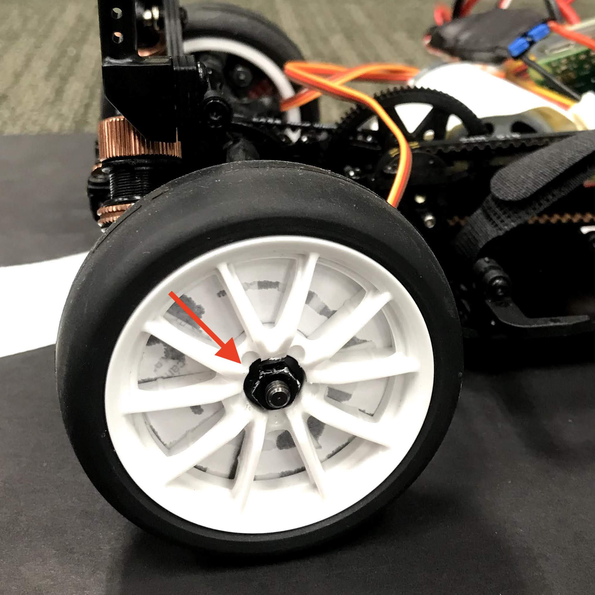
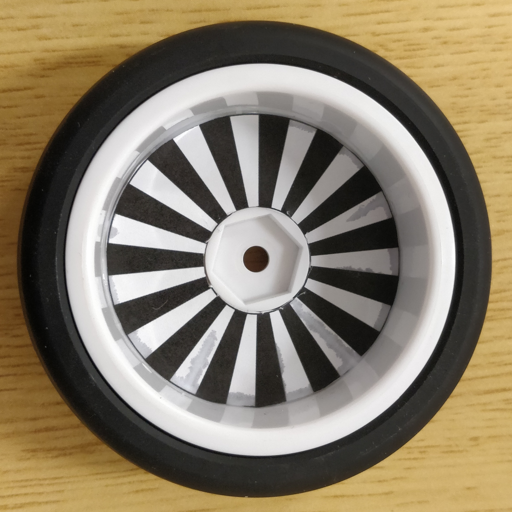
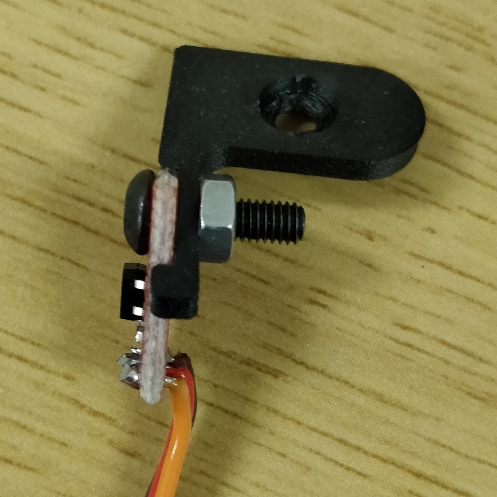
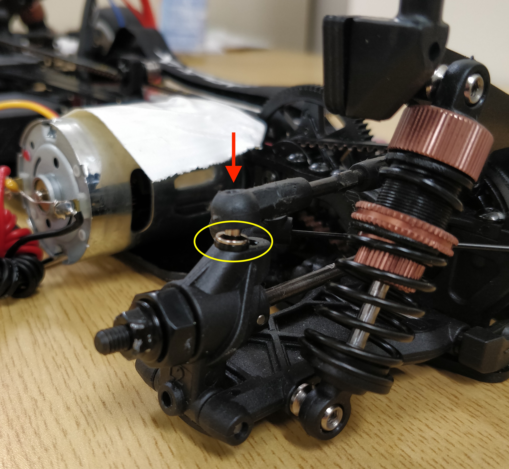

title: 3. Wheel Encoders

# Wheel Encoders and Speed Estimation

In this workshop, we will introduce an additional sensor, the wheel encoders, to help estimate your car's speed. This speed information can be utilized to improve your car's racing performance.

Parts and Components provided:

  1. 2x - Line sensors (wheel encoders)
  2. 2x - wheel spokes cut-outs
  3. 1x - left sensor mount
  4. 1x - right sensor mounts
  5. 2x - round cap screws
  6. 2x - nuts

## Installation

  1. Disassemble both of your rear tires. This is simply done by removing the hex screw as indicated by the red arrow in the image below. [Note: After the removal of the tires, be sure to secure the hex screw back to the axle to avoid accidentally losing any tire components, e.g. the securing pin.]
  {: style="height:200px;width:200px"}
  2. You will be provided with a piece of paper containing two printed copies of the "wheel spokes." Cut the outlines (both the inside and outside circles) carefully. After you  finish cutting the outlines, call any of the organizer's attention for them to help you glue these wheel spokes onto your tires. See illustration below. [Note: We don't allow students to glue these by themselves, so as to prevent them from unintentionally glueing other tire components.]
  {: style="height:200px;width:200px"}
  3. You are provided with line sensors (wheel encoders). Place the line sensor board onto the mount. Ensure that the securing holes of both the board and the mount are aligned properly. Insert the screw through the securing holes and place the nut on the other end of the screw to properly secure the sensor. See illustration below. Repeat this step for the second rear wheel encoder.
  {: style="height:200px;width:200px"}
  4. Now it is time to install the assembled wheel encoders onto the car. First dislocate the balljoint from the wheel axle by removing the screw as indicated by the red arrow. Then remove the washer as indicated by the yellow circle (depending on the car model this washer is either black or red). You will not be needing this washer anymore.
  {: style="height:200px;width:200px"}
  5. Before placing the sensors on both the rear wheels, note that the mounts provided are  dedicated left and right mounts. Place the assembled wheel encoder from where you remove the washer. The sensor will have to be facing towards the center of the car rather than facing the rear. If it is otherwise, just use the other sensor mount you assembled. Ensure that the protruding secure pin from the mount is attached properly on the axle with the securing holes aligned properly. Screw back the screw to securely fix the sensor on the wheel axle. See illustration below for the final setup.
  {: style="height:200px;width:200px"}

## Testing

  1.
