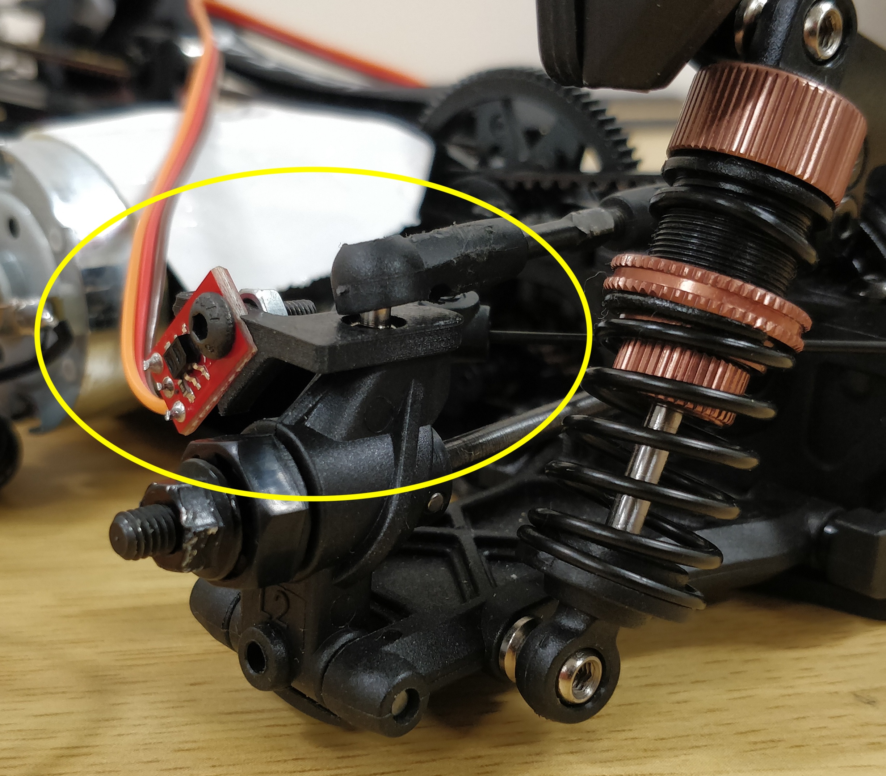

title: 3. Wheel encoders

# Wheel encoders

In this workshop, we will introduce an additional sensor, the wheel encoders, to help estimate your car's speed. This speed information can be utilized to improve your car's racing performance.

Parts and Components provided:

  1. 2x - Line sensors (wheel encoders)
  2. 2x - wheel spokes cut-outs
  3. 1x - left sensor mount
  4. 1x - right sensor mounts
  5. 2x - round cap screws
  6. 2x - nuts

## Installation

  1. Disassemble both of your rear tires. This is simply done by removing the hex screw as indicated by the red arrow in the image below. [Note: After the removal of the tires, be sure to secure the hex screw back to the axle to avoid accidentally losing any tire components, e.g. the securing pin.]
  {: style="height:400px;width:400px"}
  2. You will be provided with a piece of paper containing two printed copies of the "wheel spokes." Cut the outlines (both the inside and outside circles) carefully. After you  finish cutting the outlines, call any of the organizer's attention for them to help you glue these wheel spokes onto your tires. See illustration below. [Note: We don't allow students to glue these by themselves, so as to prevent them from unintentionally glueing other tire components.]
  {: style="height:400px;width:400px"}
  3. You are provided with line sensors (wheel encoders). Place the line sensor board onto the mount. Ensure that the securing holes of both the board and the mount are aligned properly. Insert the screw through the securing holes and place the nut on the other end of the screw to properly secure the sensor. See illustration below. Repeat this step for the second rear wheel encoder.
  {: style="height:400px;width:400px"}
  4. Now it is time to install the assembled wheel encoders onto the car. First dislocate the balljoint from the wheel axle by removing the screw as indicated by the red arrow. Then remove the washer as indicated by the yellow circle (depending on the car model this washer is either black or red). You will not be needing this washer anymore.
  {: style="height:400px;width:400px"}
  5. Before placing the sensors on both the rear wheels, note that the mounts provided are  dedicated left and right mounts. Place the assembled wheel encoder from where you remove the washer. The sensor will have to be facing towards the center of the car rather than facing the rear. If it is otherwise, just use the other sensor mount you assembled. Ensure that the protruding secure pin from the mount is attached properly on the axle with the securing holes aligned properly. Screw back the screw to securely fix the sensor on the wheel axle. See illustration below for the final setup.
  {: style="height:400px;width:400px"}

!!! note
    Feel free to change the pattern on your wheels, i.e., add more black and white stripes or create a bigger gap to detect a full rotation. You can access on Overleaf the [LaTeX source](https://www.overleaf.com/read/cxcfqgjwvswc) of the provided pattern and you can use the Overleaf editor to generate a new ones.


## Testing

Before running this code we need to install an additional Python library to read the inputs from the encoder. For that run in the terminal

```bash
sudo apt install python3-rpi.gpio
```

Next update the contents of your raceon.py file to match the one on the [GitHub](https://github.com/race-on/workshops/blob/master/raceon.py) which now includes the Encoders class.

Now we can test the encoders. Our test procedure will gradually increase the motor power, wait for 300 milliseconds for the motor to reach a stable speed at the new power, and then measure the wheels speed in a time window of 50 ms. The Jupyter Notebook with the testing procedure can be downloaded from [GitHub](https://github.com/race-on/workshops/blob/master/test-encoders.ipynb). To run it, you have to save the notebook in the same folder as the ```raceon.py``` file. Note, the 4th cell which contains the ```for``` loop will spin the wheel up to 70% power, and threfore, before running that cell pick up the car so that the wheels do not touch the floor. 

## Usage

Encoders give you a pulse per each transition from black to white or viceversa. Since we attached the encoders to the rear wheels which are connected throught a differential we can estimate besides the speed also the turning angle since the inside wheel will travel less distance. In what follows we will show how to measure the speed and the turning angle.

### Initialization

To use the encoders we need to instantiate the ```Encoders``` class which we import from the ```raceon``` library. The class constructor requires two arguments, the signal of the left and the right encoder. For the white boards these should be 25 and 27. Place the next block of code before the motor and servo itialization code in you notebook. You need to run this code only once.
```python
K   = 0.21 / 20  # distance traveled in meters per encoder pulse 
Rw  = 0.155      # distance in meters between the wheels centers

encoders = Encoders(25, 27)
```

### Reading data

Once the class is instantiated, it will continuously read pulses from the encoders. The class method ```Nl, Nr = encoders.read()``` returns the number of pulses for both wheels from the last reading. Modify your Jupyter notebook code such that the for loop looks similar to this:

```python
# Reset encoders counter
encoders.read()
encoders_array = []

for f in stream:

    [...]

    # Read encoders value
    encoders_array.append(encoders.read())
        
    # Get the intensity component of the image (a trick to get black and white images)
```

This code saves the number of pulses from the encoders into the ```encoders_array``` which we will use later for track reconstruction.


### Estimating the speed

To calculate the distance traveled by the car in meters we take the average of the two sensors and multiply by a conversion constant  defined in the initialization part.

```python
Nl, Nr   = encoders.read()
distance = (Nl + Nr) * K / 2
``` 

To obtaine the speed, divide the distance by the time between the two measurements, i.e., between the call of the ```read```method. Note, having a speed estimation you can dynamically adjust the motor duty cycle so you reach your desired speed. You can do this by adding a second PID controller the actively adjusts motor duty cycle to ensure the desired speed irespective of the battery voltage or friction.

### Estimating turning angle

Using differential measurements we can estimate how much the car turned since the last measurement. 

```python
Nl, Nr      = encoders.read()
delta_theta = (Nl - Nr) * K / Rw
```

Keeping track of the sum of these angles once the turn started would give a good extimate of how much we turned. You can decrease your lap time if you can start accelerating on the straight lines before the turn ends.

### Recostructing the car trajectory

Knowing the distance and the angle we can estimate the car position at each moment in time. Here we will use the previous saved array with the encoders data to plot the car trajectory.

```python
points = [(0, 0)]
theta  = 0

for p in encoders_array:
    d      = K * (p[1] + p[1]) / 2   # distance traveled
    theta += K * (p[1] - p[0]) / Rw  # angle turned 
    
    dp     = (points[-1][0] + d * cos(theta), points[-1][1] + d * sin(theta))
    
    points.append(dp)

points = np.array(points)

plt.plot(points[:, 0], points[:, 1], '.')
```